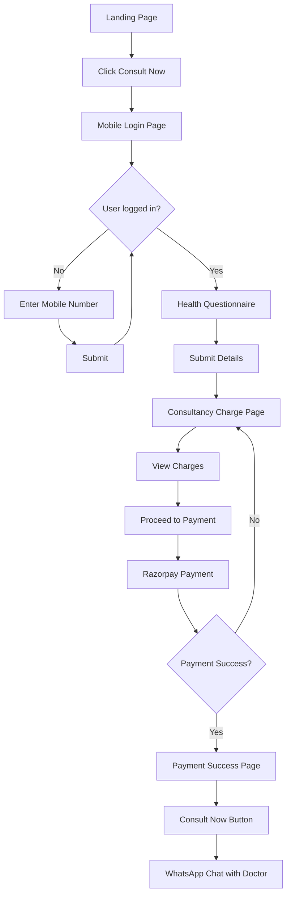

# Consultancy App Architecture

## Overview
A Next.js-based consultancy app with an end-to-end flow: Landing Page → Mobile Login → Health Questionnaire → Charge Display → Razorpay Payment → WhatsApp Redirect to Doctor.

## Tech Stack
- **Frontend**: Next.js 14 with TypeScript, Tailwind CSS, Framer Motion
- **Backend**: Next.js API Routes (built-in)
- **State Management**: React Context / Zustand
- **Payment**: Razorpay
- **Phone Auth**: Simple mobile number entry (localStorage based)

## Project Structure
```
consultancy-app/
├── src/
│   ├── app/
│   │   ├── page.tsx              # Landing page
│   │   ├── login/
│   │   │   └── page.tsx          # Mobile login page
│   │   ├── questionnaire/
│   │   │   └── page.tsx          # Health info form
│   │   ├── charge/
│   │   │   └── page.tsx          # Consultancy charge display
│   │   ├── payment/
│   │   │   └── page.tsx          # Razorpay payment page
│   │   ├── success/
│   │   │   └── page.tsx          # Payment success confirmation
│   │   ├── layout.tsx            # Root layout
│   │   └── globals.css           # Global styles
│   ├── components/
│   │   ├── ui/
│   │   │   ├── Button.tsx
│   │   │   ├── Input.tsx
│   │   │   └── Card.tsx
│   │   ├── landing/
│   │   │   ├── Hero.tsx
│   │   │   ├── Features.tsx
│   │   │   └── Testimonials.tsx
│   │   ├── login/
│   │   │   └── PhoneInput.tsx
│   │   └── shared/
│   │       └── Header.tsx
│   ├── lib/
│   │   ├── utils.ts
│   │   ├── constants.ts
│   │   └── razorpay.ts           # Razorpay configuration
│   ├── context/
│   │   └── UserContext.tsx
│   └── types/
│       └── index.ts
├── public/
│   └── images/
├── tailwind.config.ts
├── next.config.mjs
├── package.json
└── tsconfig.json
```

## User Flow Diagram


## Page Details

### 1. Landing Page (`/`)
- Hero section with CTA button
- Features/benefits section
- About the consultancy
- Testimonials
- Footer with contact info

### 2. Login Page (`/login`)
- Simple phone number input
- "Continue" button
- Success message after submission
- Store phone in localStorage
- Redirect to questionnaire

### 3. Questionnaire Page (`/questionnaire`)
- Age input
- Symptoms description (textarea)
- Duration of symptoms
- Any allergies or conditions
- Submit button → redirect to charge page

### 4. Charge Page (`/charge`)
- Display consultancy fees
- Service details
- "Pay & Consult" button → redirect to payment

### 5. Payment Page (`/payment`)
- Initialize Razorpay payment
- Show payment options
- Handle payment callback
- Redirect to success page on completion

### 6. Success Page (`/success`)
- Payment confirmation message
- "Start Consultation" button
- WhatsApp redirect with user's details pre-filled

### 7. WhatsApp Integration
```typescript
const message = `Hi, I just completed my payment for consultancy.
Details:
- Name: ${userName}
- Age: ${age}
- Symptoms: ${symptoms}
- Duration: ${duration}

Please connect me with a doctor.`;

const whatsappUrl = `https://wa.me/${doctorPhoneNumber}?text=${encodeURIComponent(message)}`;
window.open(whatsappUrl, '_blank');
```

## Razorpay Integration

### Backend API (`/api/create-order`)
```typescript
POST /api/create-order
{
  amount: number,
  currency: string,
  receipt: string
}
Returns: { orderId, amount, currency }
```

### Frontend Payment Flow
```typescript
import Razorpay from 'razorpay';

const options = {
  key: process.env.RAZORPAY_KEY_ID,
  amount: amount * 100, // Convert to paise
  currency: 'INR',
  name: 'Consultancy App',
  order_id: orderId,
  handler: (response) => {
    // Verify payment on backend
    // Redirect to success page
  }
};

const razorpay = new Razorpay(options);
razorpay.open();
```

## Key Components

### Button
- Primary and secondary variants
- Loading state
- Disabled state

### Input
- Phone number formatting
- Validation
- Error messages

### Card
- Container for content
- Hover effects
- Responsive

## State Management
- `UserContext` stores:
  - phone number
  - isLoggedIn
  - user details from questionnaire
  - payment status

## API Routes
- `/api/create-order` - Create Razorpay order
- `/api/verify-payment` - Verify payment signature
- `/api/consultation` - Save consultation request

## Environment Variables
```
RAZORPAY_KEY_ID=your_key_id
RAZORPAY_KEY_SECRET=your_key_secret
NEXT_PUBLIC_DOCTOR_WHATSAPP=1234567890
```

## Styling
- Tailwind CSS for responsive design
- Custom color palette
- Smooth transitions and animations
- Mobile-first approach

## Next Steps
1. Initialize Next.js project
2. Set up Tailwind CSS
3. Create basic components
4. Implement pages in order
5. Integrate Razorpay
6. Test the complete flow
