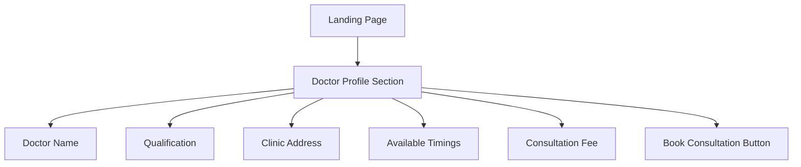

# Arogya  Homeo Consult - PRD Implementation Plan

## Executive Summary

This plan outlines the updates needed to align the existing Next.js web application with the comprehensive Product Requirements Document (PRD) for Arogya  Homeo Consult.

**Current State:** Functional Next.js web app with landing page, login, questionnaire, payment, and WhatsApp integration.

**Target State:** Fully compliant, production-ready consultancy booking app with enhanced features per PRD.

---

## Gap Analysis: Current vs. PRD Requirements

### ✅ Already Implemented
| Feature | Status | Notes |
|---------|--------|-------|
| Landing page with doctor profile | ✅ | Rich content sections exist |
| Mobile number login | ✅ | Simple entry, no OTP yet |
| Patient information form | ✅ | Multi-step questionnaire |
| Payment gateway | ✅ | Razorpay integration |
| WhatsApp redirect | ✅ | Auto-redirect after payment |
| Serverless-friendly | ✅ | Next.js API routes |

### ⚠️ Needs Enhancement
| Feature | Priority | Notes |
|---------|----------|-------|
| Doctor profile details | High | Add qualification, clinic address, timings |
| Mandatory form fields | High | Add city, full name validation |
| WhatsApp message template | Medium | Include all patient info, payment ID |
| Consent/Disclaimer | High | Add GDPR-style consent checkbox |
| Admin panel | Medium | View bookings, download CSV |
| Payment webhook | Medium | Server-side verification |

### ❌ Not Implemented
| Feature | Priority | Notes |
|---------|----------|-------|
| Admin dashboard | Medium | Web-based admin panel |
| CSV export | Low | Download patient data |
| Payment verification webhook | High | Server-side verification |

---

## Detailed Implementation Plan

### Phase 1: Core Patient Flow Enhancements (High Priority)

#### 1.1 Enhanced Doctor Profile Section
**File:** `src/components/landing/Doctor.tsx`

**Updates:**
- Add doctor's qualification (Electro Homeopath)
- Add clinic address with map link
- Add available timings
- Add consultation fee prominently
- Add WhatsApp consultation badge

**Mermaid Diagram:**


#### 1.2 Enhanced Patient Questionnaire
**File:** `src/app/questionnaire/page.tsx`

**Updates:**
- Add mandatory city/village field
- Add consent checkbox (GDPR-style)
- Add payment disclaimer
- Validate all mandatory fields before submission
- Store complete data structure per PRD

**Data Model:**
```typescript
interface PatientConsultation {
  name: string;
  age: number;
  gender: string;
  phone: string;
  problem: string;
  history: string;
  city: string;
  paymentId: string;
  paymentStatus: string;
  createdAt: string;
}
```

#### 1.3 Enhanced WhatsApp Message Template
**File:** `src/app/success/page.tsx`

**Updates:**
- Pre-fill WhatsApp message with:
  - Patient name
  - Age
  - Gender
  - Problem description
  - Past medical history
  - Payment reference ID
  - City/village

**Message Template:**
```
Hi Dr. Vinay Kumar Singh,

My name is [Name], [Age] year old [Gender] from [City].

CHIEF COMPLAINT: [Problem description]
DURATION: [Duration]
MEDICAL HISTORY: [History]
CURRENT MEDICATIONS: [Medications]
ALLERGIES: [Allergies]
STRESS LEVEL: [Level]

I have completed the payment of ₹199 (Reference: [Payment ID]).

Please guide me further.

Mobile: [Phone]
```

---

### Phase 2: Security & Compliance (High Priority)

#### 2.1 Consent Checkbox Component
**New File:** `src/components/ui/ConsentCheckbox.tsx`

**Features:**
- GDPR-style consent text
- Mandatory checkbox before payment
- Link to privacy policy
- Clear disclaimer about consultation nature

**Text:**
```
I consent to sharing my health information for consultation purposes. 
I understand this is a preliminary consultation and not a substitute for in-person medical advice. 
My data will be processed in accordance with the privacy policy.
```

#### 2.2 Payment Disclaimer
**Location:** `src/app/charge/page.tsx` and `src/app/payment/page.tsx`

**Disclaimer Text:**
```
This is a minimum consultation fee for preliminary assessment. 
Payment does not guarantee a complete cure. 
Please consult in person for serious conditions.
```

---

### Phase 3: Admin Dashboard (Medium Priority)

#### 3.1 Admin Panel Structure
**New Route:** `/admin`

**Pages:**
- `/admin/dashboard` - Overview stats
- `/admin/consultations` - List all bookings
- `/admin/settings` - Configure fee, availability

**Features:**
- View all consultations with payment status
- Search/filter by date, name, payment status
- Export data to CSV
- Update consultation fee
- Enable/disable bookings

#### 3.2 Data Export Feature
**New File:** `src/app/api/admin/export/route.ts`

**Functionality:**
- Generate CSV from Firestore/Database
- Include all patient fields
- Download as file

---

### Phase 4: Payment Verification Enhancement (Medium Priority)

#### 4.1 Server-Side Payment Verification
**File:** `src/app/api/payment/verify/route.ts`

**Current:** Client-side verification only

**Update:** Server-side verification with:
- Razorpay webhook integration
- Payment signature verification
- Database storage of verified payments

#### 4.2 Database Schema
**Suggested:** Use Firebase Firestore or Supabase

**Collections:**
- `consultations` - Patient consultation records
- `payments` - Payment transactions
- `settings` - App configuration

---

### Phase 5: UI/UX Improvements (Low Priority)

#### 5.1 Theme Updates
**File:** `tailwind.config.ts`

**Options (per PRD):**
1. **Medical Calm (Recommended):** Teal/Green (#2E8B57), White, Light Blue
2. **Ayurvedic Natural:** Olive Green, Beige, Brown
3. **Minimal Professional:** White, Navy Blue, Grey

**Current:** Green (#547726), Amber (#f9ad31) - fits "Ayurvedic Natural" theme

#### 5.2 Mobile Responsiveness
- Optimize touch targets for mobile
- Ensure WhatsApp redirect works on mobile
- Test on various screen sizes

---

## Implementation Sequence

```
┌─────────────────────────────────────────────────────────────────┐
│                    IMPLEMENTATION ROADMAP                        │
├─────────────────────────────────────────────────────────────────┤
│                                                                 │
│  Phase 1: Core Patient Flow (Week 1)                            │
│  ├── 1.1 Enhanced Doctor Profile                                │
│  ├── 1.2 Enhanced Questionnaire with Consent                    │
│  └── 1.3 Enhanced WhatsApp Message                              │
│                                                                 │
│  Phase 2: Security & Compliance (Week 1-2)                      │
│  ├── 2.1 Consent Checkbox Component                             │
│  └── 2.2 Payment Disclaimer                                     │
│                                                                 │
│  Phase 3: Admin Dashboard (Week 2-3)                            │
│  ├── 3.1 Admin Panel Structure                                  │
│  └── 3.2 CSV Export Feature                                     │
│                                                                 │
│  Phase 4: Payment Verification (Week 3)                         │
│  ├── 4.1 Server-Side Verification                               │
│  └── 4.2 Database Integration                                   │
│                                                                 │
│  Phase 5: UI/UX Improvements (Week 4)                           │
│  ├── 5.1 Theme Polish                                           │
│  └── 5.2 Mobile Optimization                                    │
│                                                                 │
└─────────────────────────────────────────────────────────────────┘
```

---

## File Changes Summary

### Modified Files
| File | Changes |
|------|---------|
| `src/components/landing/Doctor.tsx` | Add qualification, address, timings |
| `src/app/questionnaire/page.tsx` | Add city field, consent checkbox |
| `src/app/success/page.tsx` | Enhanced WhatsApp message template |
| `src/app/charge/page.tsx` | Add disclaimer text |
| `src/app/payment/page.tsx` | Add consent requirement |
| `src/lib/constants.ts` | Update doctor details, add new constants |

### New Files
| File | Purpose |
|------|---------|
| `src/components/ui/ConsentCheckbox.tsx` | GDPR consent component |
| `src/app/admin/page.tsx` | Admin dashboard |
| `src/app/admin/consultations/page.tsx` | Consultations list |
| `src/app/api/payment/webhook/route.ts` | Payment verification webhook |
| `src/app/api/admin/export/route.ts` | CSV export endpoint |

---

## Technical Recommendations

### Database Choice
**Recommendation:** Firebase Firestore (free tier generous, serverless)

**Alternative:** Supabase (PostgreSQL-based, also serverless)

### Payment Gateway
**Current:** Razorpay - Continue using

**Enhancement:** Set up webhook for server-side verification

### WhatsApp Integration
**Current:** Direct deep link - Continue using

**Future:** Consider WhatsApp Business API for automated responses

---

## Success Metrics (KPIs)

| Metric | Target | Measurement |
|--------|--------|-------------|
| Conversion rate (visit → payment) | >5% | Analytics |
| Drop-off before payment | <30% | Funnel analysis |
| WhatsApp connection success | >95% | User feedback |
| Admin panel usage | Active | Login logs |

---

## Risks & Mitigation

| Risk | Mitigation |
|------|------------|
| Payment failure | Retry button, manual WhatsApp fallback |
| WhatsApp not installed | Show phone number as alternative |
| Fake bookings | Mandatory payment before chat |
| Data misuse | Minimal data storage, consent checkbox |

---

## Next Steps

1. **Confirm Plan:** Review and approve this implementation plan
2. **Prioritize:** Decide which phases to implement first
3. **Tech Stack:** Confirm database choice (Firebase/Supabase)
4. **Start Implementation:** Switch to Code mode for development

---

*Document Version: 1.0*
*Last Updated: 2026-02-02*
